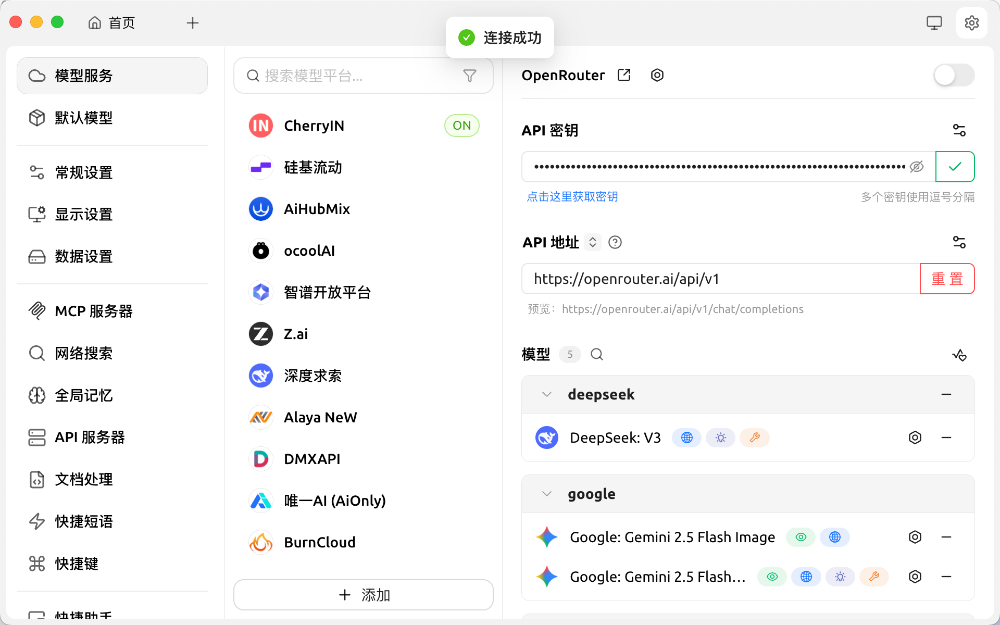
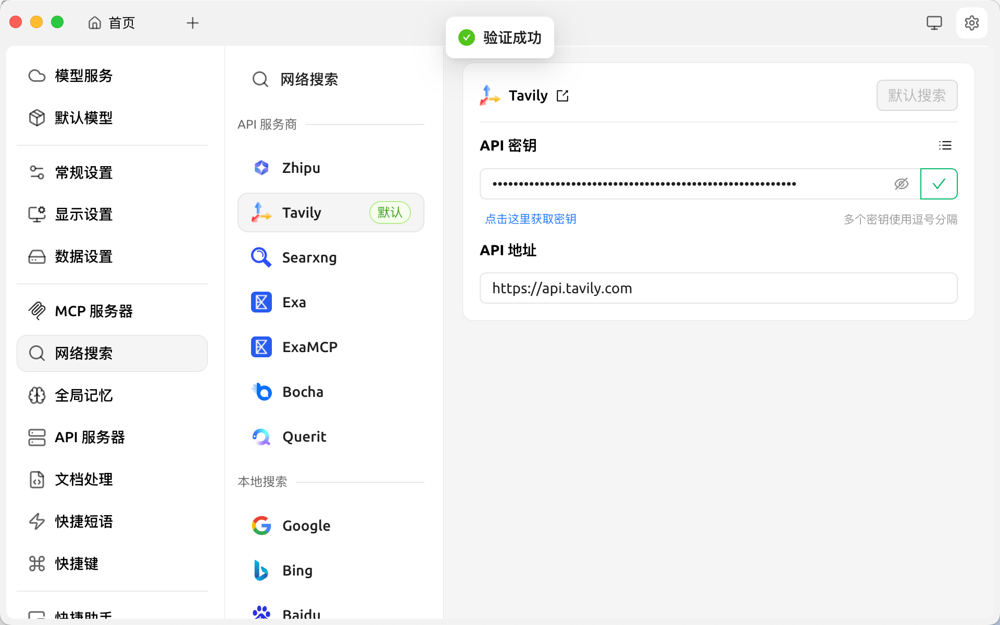
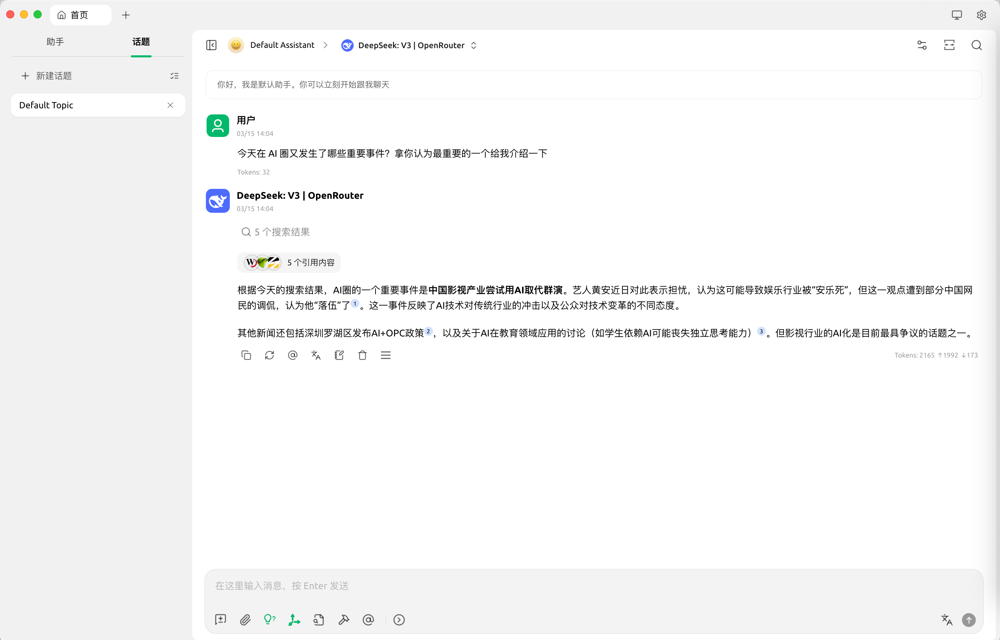
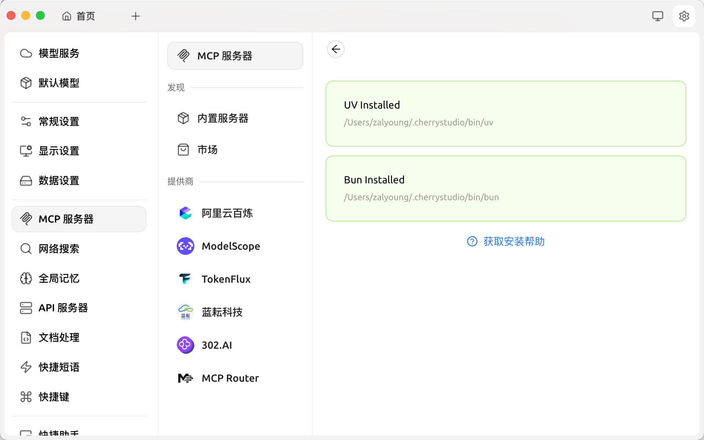
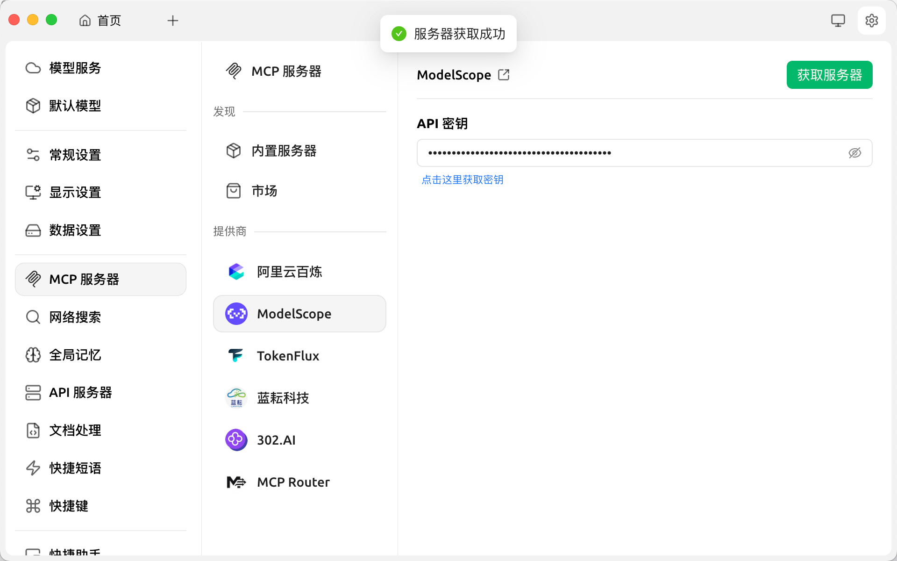
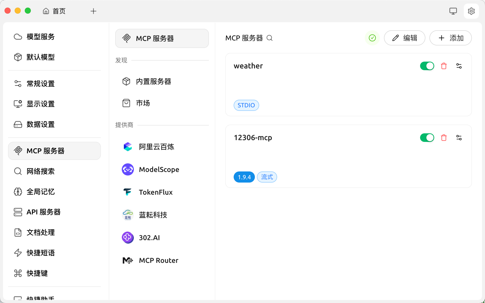
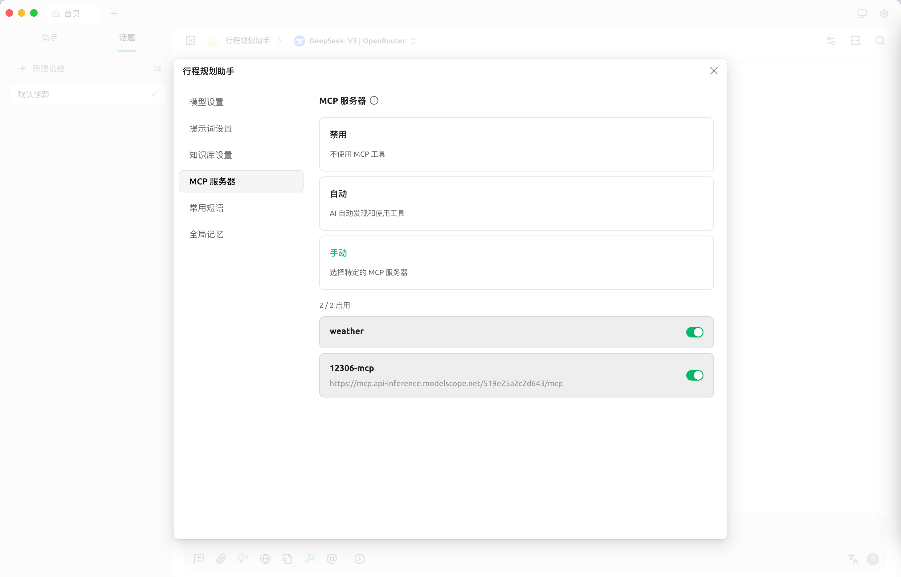
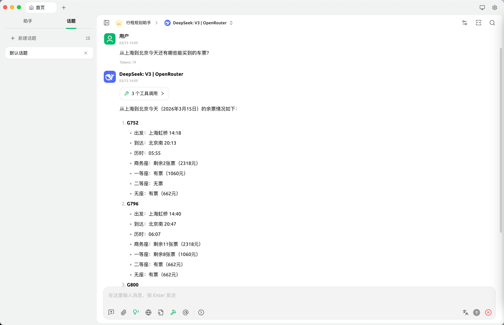

# 第11章作业：Cherry Studio 安装配置与 MCP 旅行规划助手

## 作业一：安装 Cherry Studio 并完成模型服务和联网搜索配置

### 1.1 安装 Cherry Studio

从 [Cherry Studio 官网](https://cherry-ai.com/) 下载并安装 Cherry Studio 桌面客户端（支持 macOS / Windows / Linux）。

### 1.2 配置模型服务

进入 **设置 → 模型服务**，点击右下角「+ 添加」，选择模型服务提供商并填写 API 密钥。

本次使用 **OpenRouter** 作为模型服务提供商，接入 **DeepSeek: V3** 模型：

- **API 地址**：`https://openrouter.ai/api/v1`
- **API 密钥**：填写从 OpenRouter 获取的密钥
- 点击验证按钮，显示「✅ 连接成功」即配置完成

### 1.3 配置联网搜索

进入 **设置 → 网络搜索**，选择搜索服务提供商并填写 API 密钥。

本次使用 **Tavily** 作为默认搜索引擎：

- **API 地址**：`https://api.tavily.com`
- **API 密钥**：填写从 Tavily 获取的密钥
- 点击验证按钮，显示「✅ 验证成功」即配置完成

### 1.4 成果展示：联网搜索对话

配置完成后，在对话界面选择 **DeepSeek: V3 | OpenRouter** 模型，开启联网搜索功能，向模型提问：

> 今天在 AI 圈又发生了哪些重要事件？拿你认为最重要的一个给我介绍一下

模型通过联网搜索获取了 5 个搜索结果，并基于实时信息给出了回答，成功实现了联网搜索功能。

---

## 作业二：安装 12306 MCP Server，实现旅行规划助手

### 2.1 安装 MCP 基础组件

进入 **设置 → MCP 服务器**，点击「内置服务器」，Cherry Studio 会自动检测并安装所需的基础运行环境：

- **UV**：已安装，路径 `/Users/zalyoung/.cherrystudio/bin/uv`
- **Bun**：已安装，路径 `/Users/zalyoung/.cherrystudio/bin/bun`

### 2.2 配置 MCP 供应商（ModelScope）

进入 **设置 → MCP 服务器 → 提供商 → ModelScope**，填写 ModelScope API 密钥：

- 点击「获取服务器」按钮，显示「✅ 服务器获取成功」即配置完成

### 2.3 添加 12306 MCP 服务器

在 MCP 服务器列表中，添加 **12306-mcp** 服务器：

- **服务器名称**：`12306-mcp`
- **连接方式**：流式（SSE）
- **服务器地址**：`https://mcp.api-inference.modelscope.net/519e25a2c2d643/mcp`
- **版本**：1.9.4

同时保留已有的 **weather** MCP 服务器（STDIO 方式），两个服务器均已启用（绿色开关）。

### 2.4 创建行程规划助手

在助手配置中，创建「行程规划助手」，并在 **MCP 服务器** 设置中选择「手动」模式，启用以下两个 MCP 服务器（2/2 启用）：

- ✅ **weather**：提供天气查询能力
- ✅ **12306-mcp**：提供实时火车票查询能力（`https://mcp.api-inference.modelscope.net/519e25a2c2d643/mcp`）

模型选择：**DeepSeek: V3 | OpenRouter**

### 2.5 成果展示：行程规划助手对话

配置完成后，使用「行程规划助手」进行实时火车票查询：

> 从上海到北京今天还有哪些能买到的车票？

助手通过调用 **3 个工具**（12306-mcp 提供的查询接口），实时查询了 2026年3月15日 上海→北京 的余票情况，返回了详细的车次信息：

| 车次 | 出发站 | 出发时间 | 到达站 | 到达时间 | 历时 | 商务座 | 一等座 | 二等座 |
|------|--------|----------|--------|----------|------|--------|--------|--------|
| G752 | 上海虹桥 | 14:18 | 北京南 | 20:13 | 05:55 | 剩余2张（2318元） | 有票（1060元） | 无票 |
| G796 | 上海虹桥 | 14:40 | 北京南 | 20:47 | 06:07 | 剩余11张（2318元） | 剩余8张（1060元） | 有票（662元） |
| G800 | 上海虹桥 | ... | 北京南 | ... | ... | ... | ... | ... |

成功实现了基于 DeepSeek-V3 + 12306 MCP Server 的实时旅行规划助手！

---

## 总结

| 作业 | 完成情况 | 关键技术 |
|------|----------|----------|
| 作业一：Cherry Studio 安装 + 模型服务 + 联网搜索 | ✅ 完成 | OpenRouter API + Tavily 搜索 |
| 作业二：12306 MCP Server + 旅行规划助手 | ✅ 完成 | ModelScope MCP + 12306-mcp |

通过本次作业，掌握了：
1. **Cherry Studio** 的安装与基础配置方法
2. 通过 **OpenRouter** 接入 DeepSeek-V3 等大模型
3. 配置 **Tavily** 实现联网实时搜索
4. 安装和配置 **MCP 服务器**（UV/Bun 运行环境）
5. 接入 **12306 MCP Server** 实现实时火车票查询
6. 构建具备工具调用能力的 **旅行规划 AI 助手**